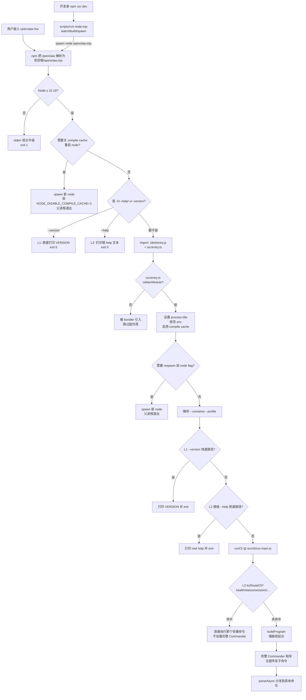
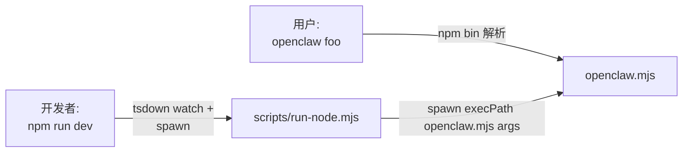
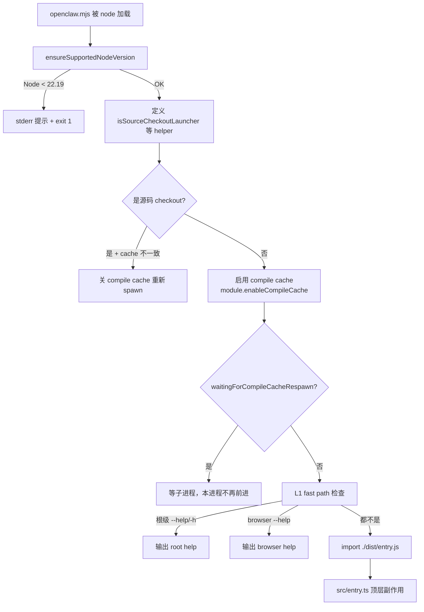
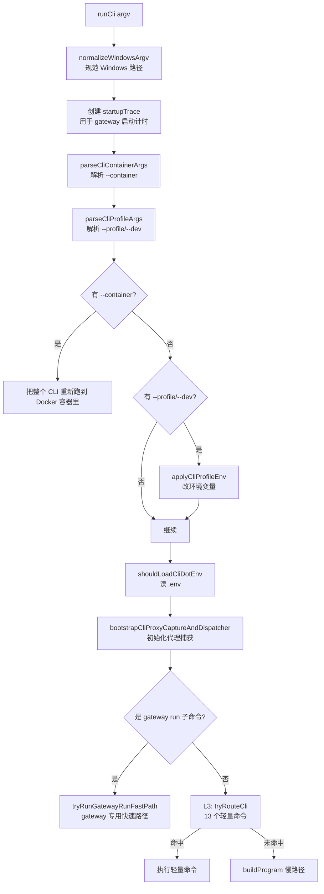

<!-- doc-version: v2026.5.18 -->
<!-- last-verified: 2026-05-21 -->
<!-- source-anchors: openclaw.mjs, scripts/run-node.mjs, src/entry.ts, src/entry.respawn.ts, src/entry.compile-cache.ts, src/cli/run-main.ts, src/cli/route.ts -->
<!-- reading-order: 第一篇，无前置 -->

# 启动流程：从命令到 CLI 主流程

## 一句话总结

从用户敲入 `openclaw` 命令到 OpenClaw 真正开始解析子命令，中间经过 **3 层"包装/守卫"**（包装入口 → entry.ts 顶层守卫 → CLI 启动检查）和 **3 层快速路径**（version → help → 13 个轻量命令），全部为了一个目的：**让常见命令秒响应、复杂命令再走完整加载**。

---

## 0. 阅读这篇之前

你不需要预备知识，但建议先看一眼：

- `package.json` 的 `bin` 字段（项目根，第 5 行附近）
- `src/entry.ts` 顶部你自己加的 `lyc:aic` 4 阶段骨架注释

如果以下术语对你陌生，**继续读，正文里都会展开解释**：
- **Wrapper 入口**（openclaw.mjs）
- **Respawn**（重启 node 进程）
- **Compile cache**（Node 22+ 的编译缓存）
- **Fast path**（绕开完整加载的快速分支）

---

## 1. 全景图



**图里发生了什么**：

外层有两条入口（用户用 / 开发者用），都汇合到 `openclaw.mjs`。**`openclaw.mjs` 干粗活**（Node 版本、compile cache、最浅层 fast path），**`src/entry.ts` 干细活**（进程级初始化、深层 respawn、profile/container）。最后调用 `runCli` 进入"CLI 真正的主流程"，那里还有一层 L3 快速路径，没命中才进 buildProgram。

---

## 2. 关键概念

按它们在流程里出现的顺序讲。

### 2.1 Wrapper 入口（`openclaw.mjs`）

**一句话定义**：`openclaw.mjs` 是 OpenClaw 的"真入口前的包装文件"——它做几件 `dist/entry.js`（真入口）做不了的事，然后再 `import` 真入口。

**它解决什么问题**：

如果 npm 直接把 `openclaw` 命令链到 `dist/entry.js`，会有这些麻烦：
1. **Node 版本不达标时报错丑陋**：`dist/entry.js` 是 ES Module 加 TypeScript 编译产物，Node 18 跑会抛底层 `Unexpected token` 或 module resolution 错误，普通用户根本看不懂。
2. **没法在加载主程序前先开 / 关 compile cache**：compile cache 必须在任何 `import` 之前 enable。包装器是"任何 import 之前的位置"。
3. **没法在加载主程序前先输出 `--help`/`--version`**：完整入口加载要几秒，但只为打个版本号就等几秒太蠢。

**具体例子**（基于代码推断，未实际运行）：

用户在终端敲：
```bash
openclaw --version
```

发生：
1. shell 通过 PATH 找到 `openclaw`，这其实是个 symlink，指向已安装包里的 `openclaw.mjs`（依据：`package.json` 的 `"bin": { "openclaw": "openclaw.mjs" }`）
2. Node 运行 `openclaw.mjs`，先做 Node 版本检查（[openclaw.mjs](../../../openclaw.mjs) 的 `ensureSupportedNodeVersion` 函数）
3. 检测到 argv 是 `--version`，进入 **L1 快速路径**：直接读 `dist/cli-startup-metadata.json` 拿版本号、`process.stdout.write` 输出、退出
4. **不**加载 `dist/entry.js`，**不**加载任何插件

预期输出（未验证，依据 v2026.5.18 代码推断）：
```
2026.5.18
```

**源码**：见 [openclaw.mjs](../../../openclaw.mjs)，主流程在文件最后那个大 `if/else` 块（约 line 401 起）。

### 2.2 Compile cache（Node 22+ 编译缓存）

**一句话定义**：Node 22 新增的内置功能，把 JIT 编译产物存到磁盘，**第二次启动直接复用**。

**它解决什么问题**：

OpenClaw 启动要 `import` 几十个模块，每次启动 Node 要把每个 `.js` 文件 parse + 编译成字节码，**冷启动 800ms-2s 都正常**。`module.enableCompileCache()` 让 Node 把字节码缓存到磁盘，第二次启动直接读，**热启动 ~200ms**。

**具体例子**（依据代码推断）：

第一次跑 `openclaw status`（假设跑得通）：
- Node 开始编译每个 import 的模块
- compile cache 文件夹写满（例如 `$TMPDIR/node-compile-cache/openclaw/2026.5.18/<hash>/...`）
- 总耗时 ~1s

第二次跑（一秒之内）：
- Node 发现 cache hit，直接从磁盘读字节码
- 总耗时 ~200ms

**v2026.5 的新增点**：在 `src/entry.ts` 顶部新增了 `respawnWithoutOpenClawCompileCacheIfNeeded` 守卫。

**为什么**：某些场景下，比如**源代码 checkout 启动**（你正在做的事），compile cache 的内容会和源代码不同步（因为你改了 TS 文件但 cache 还指向旧编译产物）。这时就**关掉 cache 重新 spawn 一个新 node 进程**。

源码：见 `enableOpenClawCompileCache` 和 `respawnWithoutOpenClawCompileCacheIfNeeded` @ [src/entry.compile-cache.ts](../../../src/entry.compile-cache.ts)。

### 2.3 Respawn 机制（重启 Node 进程）

**一句话定义**：spawn 一个新 node 子进程、让父进程退出。**整个 CLI 的执行权交给子进程**。

**它解决什么问题**：

Node 的某些启动选项**只能在 node 启动时通过命令行传入**，进程跑起来后改不了。例子：
- `--max-old-space-size=4096`（堆大小）
- `--disable-warning=ExperimentalWarning`（屏蔽实验性警告）
- `NODE_EXTRA_CA_CERTS=/path/to/ca.pem`（额外的 CA 证书）

如果 OpenClaw 在运行中决定"我需要 4GB 堆"，已经晚了——内存上限就是当前进程启动时定的。**唯一解法**：spawn 一个新 node 进程，把这些选项传进去，让新进程接管 CLI，老进程退出。

**具体例子**（依据代码推断）：

假设用户跑：
```bash
openclaw gateway run
```

而 `gateway` 需要 4GB 堆。流程：

1. 老 node 进程启动 `openclaw.mjs`
2. 加载 `dist/entry.js`（= `src/entry.ts`）
3. `ensureCliRespawnReady()` 决定需要 respawn（因为没有 `--max-old-space-size`）
4. spawn 一个新进程：
   ```
   node --max-old-space-size=4096 --disable-warning=ExperimentalWarning openclaw.mjs gateway run
   ```
5. 新进程开始执行（重新走一遍 openclaw.mjs → entry.ts），但这次因为 env 变量已设置 `OPENCLAW_NODE_OPTIONS_READY=1`，`ensureCliRespawnReady` 返回 false，**不再重 spawn**
6. 老进程的 `attachChildProcessBridge` 把信号（Ctrl-C 等）转发给新进程，然后老进程等子进程退出后自己退出

**用户感知**：完全无感。但用 `ps` 或 `Get-Process` 看，会看到**两个 node 进程**——一个老的、一个新的（老的是个"短命启动器"）。

**源码**：
- 决策（要不要 respawn）：`buildCliRespawnPlan` @ [src/entry.respawn.ts](../../../src/entry.respawn.ts)
- 实施（spawn + 桥接）：`runCliRespawnPlan` @ [src/entry.respawn.ts](../../../src/entry.respawn.ts)
- 在 `entry.ts` 中的调用：`ensureCliRespawnReady` 内联函数

**v2026.5 新增的 compile-cache respawn**：和上面的"flag respawn"是**两条独立**的 respawn 路径，分别处理不同问题。compile-cache respawn 在更早一步，先检查；如果它触发了，连 process.title 都还没设。

### 2.4 3 层快速路径（L1/L2/L3）

**一句话定义**：OpenClaw 有 3 个"拦截点"，分别在不同深度处理简单命令——命中后**直接执行**并退出，**不**走完整 Commander 加载。

**它解决什么问题**：

完整 OpenClaw 启动要：
1. 加载 Commander 命令解析库（几十 KB）
2. 注册所有内置子命令（health/status/onboard/gateway/agents/sessions...）
3. 扫描配置文件、发现插件
4. 注册插件子命令
5. 然后才能 parse argv 并 dispatch

**根据代码推断，整套流程在源码 checkout 下约 1-3 秒**。对 `openclaw --version`（用户只想看版本号）这种命令，等 3 秒**极其不合理**。所以 OpenClaw 在 3 个递进的深度放了 3 个"拦截器"：

| 层 | 文件 | 位置（粗略） | 拦截 |
|---|---|---|---|
| **L1** `tryOutputBareRootHelp` + `--version` 直接处理 | [openclaw.mjs](../../../openclaw.mjs) | 包装器层，加载 entry.js 之前 | `openclaw --help`（根级）/ `openclaw --version` |
| **L2** `tryHandleRootVersionFastPath` + `tryHandleRootHelpFastPath` | [src/entry.ts](../../../src/entry.ts) | entry.ts 内，加载 run-main.ts 之前 | `--version` / `-v` / 根级 `--help` |
| **L3** `tryRouteCli` | [src/cli/route.ts](../../../src/cli/route.ts) | runCli 内，加载 buildProgram 之前 | 13 个轻量命令 |

**L3 的 13 个轻量命令清单**（依据 `tryRouteCli` 检查、命中后通过 `findRoutedCommand` 分发）：

```
health · status · gateway-status · sessions ·
agents-list · config-get · config-unset ·
models-list · models-status · tasks-list ·
tasks-audit · channels-list · channels-status
```

这些命令的共同点：**不需要插件运行**，只需要读配置或简单查询。

**具体例子 A**（L1 命中）：

```bash
openclaw --version
```

1. `openclaw.mjs` 检测到 `--version`，进 L1
2. 读 `dist/cli-startup-metadata.json` 中的 `version` 字段
3. `process.stdout.write` 打印版本号
4. exit 0
5. **不**触发 `import("./dist/entry.js")`

预期输出：`2026.5.18`（依据 v2026.5.18 推断）。

**具体例子 B**（L1/L2 不命中，L3 命中）：

```bash
openclaw status
```

1. `openclaw.mjs` 检查不是 --help/--version，正常 `import dist/entry.js`
2. `entry.ts` 顶层 if/else 走 else 分支（isMainModule=true）
3. 4 阶段初始化 + 不需要 respawn
4. L1 (`tryHandleRootVersionFastPath`) 未命中（不是 --version）
5. L2 (`tryHandleRootHelpFastPath`) 未命中（不是 --help）
6. 调用 `runMainOrRootHelp` → `runCli`
7. `runCli` 内部到达 L3：`tryRouteCli(['node', 'openclaw.mjs', 'status'])`
8. `findRoutedCommand` 在路由表里找到 `status`，返回 route 对象
9. 调用 route.run(argv)，执行 status 命令
10. **不**进入 buildProgram，**不**注册全部子命令

预期输出（未验证，依据代码推断）：会显示 OpenClaw 状态、配置健康度、当前通道连接情况等。

**具体例子 C**（3 层全部不命中，进慢路径）：

```bash
openclaw onboard --modern
```

1. L1/L2 都不是 help/version，跳过
2. L3：`onboard` 不在轻量命令清单里，`findRoutedCommand` 返回 null
3. 进入 `buildProgram` 慢路径
4. 加载 Commander、注册所有命令（包括插件命令）
5. `program.parseAsync(argv)` 分发到 onboard handler
6. onboard 流程启动（Crestodian assistant）

**根据代码推断**，这条路径大概要 1-3 秒（取决于安装了多少插件）。

**源码追踪**：
- L1 在 `openclaw.mjs` 文件末尾 if/else，搜 `tryOutputBareRootHelp` / `isBareRootHelpInvocation`
- L2 是 `tryHandleRootVersionFastPath` 和 `tryHandleRootHelpFastPath` @ [src/entry.ts](../../../src/entry.ts)
- L3 是 `tryRouteCli` @ [src/cli/route.ts](../../../src/cli/route.ts)，路由表见 `findRoutedCommand` @ [src/cli/program/routes.ts](../../../src/cli/program/routes.ts)

---

## 3. 阶段分解

### 阶段 0：入口选择



OpenClaw 有**两种启动场景**：

| 场景 | 谁触发 | 入口 |
|---|---|---|
| 已安装使用 | 终端用户敲 `openclaw foo` | `openclaw.mjs`（symlink 自 npm bin） |
| 源码开发 | 你跑 `npm run dev` | `scripts/run-node.mjs` → 它 watch 源码、调 tsdown 编译，然后 `spawn` `node openclaw.mjs ...` |

**两条路径汇合到 `openclaw.mjs`**。后面流程一致。

**具体例子**（源码开发场景）：

```bash
npm run dev -- status
```

1. npm 触发 `scripts/run-node.mjs`
2. `run-node.mjs` 检查是否需要重新编译（看 `.buildstamp` 文件时间戳）
3. 如果需要，调 `tsdown` 编译 `src/` → `dist/`
4. spawn 子进程：`node <project>/openclaw.mjs status`（见 `runOpenClaw` 函数 @ [scripts/run-node.mjs](../../../scripts/run-node.mjs)）
5. 子进程接管，开始走 openclaw.mjs 的流程

**`scripts/run-node.mjs` 的本质**：开发模式下的"持续监视 + 自动重启"包装器。**生产用户用不到这个文件**。

### 阶段 1：openclaw.mjs 包装入口



文件位置：[openclaw.mjs](../../../openclaw.mjs)（项目根）

主要工作（按顺序）：
1. **Node 版本守卫** `ensureSupportedNodeVersion`：要求 Node ≥ 22.19，否则打印升级提示后 `process.exit(1)`
2. **定义 helper 函数们**：`isSourceCheckoutLauncher`（是不是源码 checkout 启动？看有没有 `.git` 或 `src/entry.ts`）、`runRespawnedChild`（spawn 子进程 + 信号桥接）、`respawnWithoutCompileCacheIfNeeded`、`respawnWithPackagedCompileCacheIfNeeded`
3. **决定 compile cache 策略**：
   - 源码 checkout 场景：可能要关掉 compile cache（避免读到陈旧字节码）→ spawn 重启
   - 已安装包场景：默认开启 compile cache，把它放到 `$TMPDIR/node-compile-cache/openclaw/<version>/<install-marker>/`
4. **L1 快速路径**：检测裸 `--help` 或 `browser --help`，命中则用预生成的 `dist/cli-startup-metadata.json` 直接输出（**完全不**加载 entry.js）
5. **加载警告过滤器**：`installProcessWarningFilter()`（从 `dist/warning-filter.js`）—— 这一步是为了在加载 entry.js 之前先抑制掉 Node 启动时的实验性警告
6. **import 真入口**：`await tryImport("./dist/entry.js")`（或 `.mjs`），把控制权交给 src/entry.ts

### 阶段 2：src/entry.ts 顶层副作用

**核心特点**：这个文件**没有 `main()` 函数**，整个执行流程就是文件**顶层的 if/else 块**（被 import 时立即执行）。

```ts
if (
  !isMainModule({
    currentFile: fileURLToPath(import.meta.url),
    wrapperEntryPairs: [...ENTRY_WRAPPER_PAIRS],
  })
) {
  // 当作依赖被 import：跳过所有副作用
} else {
  // 实际入口逻辑
  // ...
}
```

文件位置：[src/entry.ts](../../../src/entry.ts)

**isMainModule 守卫**解决的问题：bundler（tsdown/webpack 等）可能把 entry.js 当成共享依赖 import 进其他模块。如果它每次被 import 都跑入口逻辑，会出现"启动了两个 gateway"导致端口冲突。守卫保证**只有作为命令行真入口启动时**才执行副作用。

`else` 分支里的 5 个阶段（你已经在自己的 `lyc:aic` 顶部注释里总结过了）：

| 阶段 | 干什么 | 关键源码 |
|---|---|---|
| [1] isMainModule 守卫 | 已在 if 条件里完成 | `isMainModule` from `src/infra/is-main.ts` |
| [2] compile-cache respawn 守卫 | 必要时重启 node 关 compile cache | `respawnWithoutOpenClawCompileCacheIfNeeded` |
| [3] 进程级初始化 | `process.title="openclaw"` / `OPENCLAW_CLI=1` / 警告过滤 / 规范 env / 启用 compile cache | 直接代码块 |
| [4] Respawn 分支 | 必要时 spawn 新 node 子进程，父进程退出 | `ensureCliRespawnReady` → `runCliRespawnPlan` |
| [5] 参数解析+路由 | 处理 `--container` / `--profile` / `--dev` → L1/L2 快速路径 → `runCli` | `parseCliContainerArgs` / `parseCliProfileArgs` / `tryHandleRootVersionFastPath` / `runMainOrRootHelp` |

**L1 在 entry.ts 是 `tryHandleRootVersionFastPath`**：注意 openclaw.mjs 也有 L1（处理裸 help），是**两个不同位置但都叫 L1 的"最早拦截层"**。准确说：
- `openclaw.mjs` L1 拦截 root help（不加载 entry.js）
- `entry.ts` L1 拦截 `--version`（已加载 entry.js，但不加载 run-main.ts）

如果 `openclaw.mjs` L1 没拦到（比如用户敲 `openclaw status --help`，不是裸 help），就会继续到 entry.ts，由 entry.ts 的 L2 拦截子命令的 `--help`。

### 阶段 3：src/cli/run-main.ts 的 runCli

文件位置：[src/cli/run-main.ts](../../../src/cli/run-main.ts)



主要看点：

1. **`startupTrace`**：v2026.5 新增的细粒度计时机制。用 `OPENCLAW_GATEWAY_STARTUP_TRACE=1` 触发，输出到 stderr：
   ```
   [gateway] startup trace: cli.main.dotenv 12.3ms total=89.4ms
   ```
   每个阶段都用 `startupTrace.measure(name, () => ...)` 包了一层。**只是诊断用**，不影响正常流程。

2. **`maybeRunCliInContainer`**：如果 argv 里有 `--container <name>`，OpenClaw 会把整个 CLI 拉到 Docker 容器里跑（用 podman 或 docker）。**当前进程在调用后会退出**——后续逻辑跑在容器内的新 node 进程里。

3. **`tryRunGatewayRunFastPath`**：v2026.5 新增的 `gateway run` 专用快速路径。`gateway run` 是 OpenClaw 最重要的命令（启动网关常驻服务），所以它有**独立的快速路径**，绕开完整 Commander 加载。

4. **L3 `tryRouteCli`**：见 §2.4 的清单。这一层只在 L1/L2 都没命中、且不是 gateway-run 时才执行。

5. **buildProgram 慢路径**：到这里就是"完整 OpenClaw"——构建 Commander 程序、注册所有子命令（核心 + subcli + plugin）、`program.parseAsync(argv)` 分发。这部分会在下一篇 [02-cli-routing.md](02-cli-routing.md)（待写）详细讲。

### 阶段 4：命令分发（慢路径）

**这部分留给 `02-cli-routing.md`**，本篇只给个出口图：


---

## 4. 完整案例对比

下面 3 个案例覆盖 3 条不同路径，**全部基于代码推断**（lyc 没运行过 OpenClaw）。

### 案例 A：`openclaw --version`（L1 命中）

**输入**：终端敲 `openclaw --version`

**调用链**：
1. shell → `<install>/openclaw.mjs`（npm bin 解析）
2. `openclaw.mjs` 顶层 `ensureSupportedNodeVersion()` 通过
3. 走到 `tryOutputBareRootHelp` —— 检测到 `--version` 不是 help，返回 false
4. 走到 `tryImport("./dist/entry.js")`
5. `entry.ts` 顶层 isMainModule=true，进 else 分支
6. 阶段 [1]-[4] 都走完，没需要 respawn
7. 阶段 [5] argv 处理 → `tryHandleRootVersionFastPath(argv)` 命中（L1 / 在 entry.ts 内）
8. 直接输出 VERSION，进程 exit 0

**预期输出**（依据代码推断）：
```
2026.5.18
```

**重点**：**没**调用 `runCli`，没加载 `src/cli/run-main.ts`，没加载 Commander。

### 案例 B：`openclaw status`（L3 命中）

**调用链**：
1. shell → `openclaw.mjs`
2. Node 版本 OK
3. L1 root-help 不命中（不是 help）
4. import `dist/entry.js`
5. entry.ts 进 else
6. 阶段 [1]-[4] 走完
7. L1 (entry.ts) 不命中（不是 --version）
8. L2 (entry.ts) 不命中（不是根级 --help）
9. 调用 `runCli(argv)`
10. `runCli` 内：argv 处理、startupTrace、proxy bootstrap
11. **L3 `tryRouteCli` 命中** `status` 是 13 个轻量命令之一
12. `findRoutedCommand(['status'])` 返回 status 的 route 对象
13. `route.run(argv)` 执行 status 处理逻辑（在 [src/cli/program/routes.ts](../../../src/cli/program/routes.ts) 的路由表里定义）

**预期输出**（**未验证**）：根据 status 命令的语义，应该会输出 OpenClaw 的运行时状态（gateway 是否运行、配置是否有效、通道连接情况）。具体格式需要看 status 命令实现。

**重点**：没加载 `buildProgram`，没注册插件。

### 案例 C：`openclaw onboard --modern`（慢路径）

**调用链**：
1-9. 同案例 B 前 9 步
10. `runCli` 内：argv 处理、startupTrace、proxy bootstrap
11. **L3 `tryRouteCli` 不命中**（onboard 不在 13 个轻量命令清单里）
12. 进入 buildProgram 慢路径
13. 显示进度条 `Loading OpenClaw CLI…`
14. `buildProgram()` 构造 Commander 实例
15. `enableConsoleCapture` 启动结构化日志
16. 安装 uncaughtException / unhandledRejection 全局处理器
17. 注册核心命令（包括 onboard、gateway、agents 等）
18. 加载插件 CLI 命令（`registerPluginCliCommandsFromValidatedConfig`）
19. `program.parseAsync(argv)` 解析 → 调用 onboard handler
20. onboard handler 调用 Crestodian assistant 启动 wizard

**预期输出**（**未验证**）：根据 README "Preferred setup: run `openclaw onboard` in your terminal. OpenClaw Onboard guides you step by step through setting up the gateway, workspace, channels, and skills." 这段话推断，会进入一个**交互式向导**，逐步问用户问题（你想接哪些 channel、装哪些 skill 等）。

**重点**：这是**完整启动**，需要加载 Commander + 全部命令 + 插件配置。耗时根据 v2026.5 代码里加的 `startupTrace` 推断大概 1-3s（源码 checkout 启动），打包后可能更快。

---

## 5. v2026.5 相对 4.26 的关键新增

为了让你以后看到这些"新东西"时能秒认出，列一下：

| v2026.5 新增 | 文件 | 解决问题 |
|---|---|---|
| `respawnWithoutOpenClawCompileCacheIfNeeded` | [src/entry.compile-cache.ts](../../../src/entry.compile-cache.ts) | compile cache 与源码不同步时关 cache 重启 |
| `runCliRespawnPlan` 抽出（带超时机制） | [src/entry.respawn.ts](../../../src/entry.respawn.ts) | 之前 spawn 子进程后父进程立即退出可能让子进程信号丢失；新机制有 1 秒 grace + 强制 SIGKILL 兜底 |
| `gatewayEntryStartupTrace` / `createGatewayCliMainStartupTrace` | entry.ts / run-main.ts | 启动各阶段计时（用 `OPENCLAW_GATEWAY_STARTUP_TRACE=1` 触发） |
| `tryRunGatewayRunFastPath` | run-main.ts | gateway run 子命令独立快速路径 |
| `bootstrapCliProxyCaptureAndDispatcher` | run-main.ts | 把原本内联在 runCli 里的 4 步 proxy 启动抽成 helper |
| `shouldBootstrapCliProxyBeforeFastPath` | run-main.ts | 用 env 检测是否要在 fast-path 之前就拉起 proxy（影响启动顺序）|

详细对比见 lyc:aic 注释（在 entry.ts / run-main.ts 顶部和关键函数旁），以及 [`.ai_claude/snapshots/`](../../snapshots/) 里的 4.26 快照。

---

## 6. 自检：你看完这篇，应该能回答

1. `openclaw --version` 为什么不需要 1 秒？
2. `openclaw onboard` 启动时为什么会看到**两个** node 进程？
3. 如果一个新命令 `openclaw mycmd` 想做成快速路径（不加载插件），应该改哪个文件？
4. `--container` 和 `--profile` 为什么是**互斥**的？
5. 我（lyc）在 src/entry.ts 顶部的 4 阶段 lyc:aic 注释，为什么 v2026.5 改成了 5 阶段？

（不会答说明这一节没写好——告诉 Claude "01-startup-flow.md 的 X 问题我答不出来"，重写那段）

---

## 7. 相关文档

- ⬅ 上一篇：（无，这是 mechanism 系列第 1 篇）
- ➡ 下一篇：[02-cli-routing.md](02-cli-routing.md) — 3 层快速路径 + buildProgram 慢路径详解（待写）
- 🔗 概念基础：[00-overview/what-is-openclaw.md](../00-overview/what-is-openclaw.md)（待写）
- 🔗 术语：[00-overview/glossary.md](../00-overview/glossary.md)（待写）
- 🔗 你的笔记：[`src/entry.ts`](../../../src/entry.ts) 顶部 `lyc:aic` 4-stage skeleton 注释
- 🔗 4.26 快照对比：[`.ai_claude/snapshots/`](../../snapshots/)
