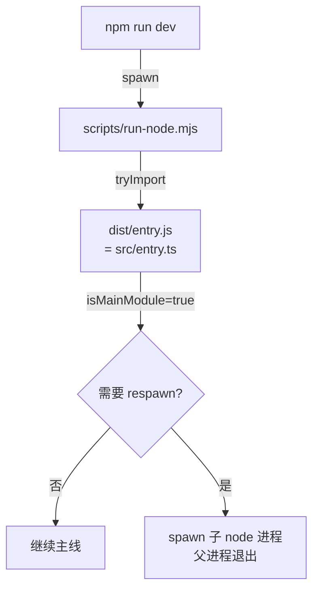

<!-- doc-version: v2026.5.18 -->
<!-- last-verified: 2026-05-21 -->

# 文档规约

本规约由 lyc 与 Claude 共同维护，**所有 `.ai_claude/study_doc/` 下的新文档必须遵守**。

---

## 0. 读者画像（最重要）

文档读者 **lyc**：
- 中文程序员，能读 TypeScript / JavaScript
- **从未运行过 OpenClaw**，纯靠读源码学习
- **不知道** `openclaw onboard` 跑起来是什么样子
- **不知道** 配置文件 `openclaw.json` 长什么样
- **不知道** Discord/Telegram channel 接入后的真实体验

**所有抽象概念都必须显式给出具体场景**，否则等于没讲。

---

## 1. 每篇文档的头部

固定四行 HTML 注释，紧贴在第一行：

```markdown
<!-- doc-version: v2026.5.18 -->
<!-- last-verified: 2026-05-21 -->
<!-- source-anchors: src/cli/run-main.ts, src/entry.ts -->
<!-- reading-order: after 00-overview/what-is-openclaw.md -->
```

- `doc-version`: 文档基于的 OpenClaw 版本 tag
- `last-verified`: 最后一次人工/Claude 核对源码的日期
- `source-anchors`: 这篇文档主要追的源码文件（升级时用来 `git diff` 定位影响）
- `reading-order`: 阅读这篇前应该先看哪篇（让 Claude 帮你规划学习顺序时用）

---

## 2. 抽象概念的强制模板

任何"看不见摸不着"的概念（机制、抽象类型、约定、状态机等）必须用以下模板：

```markdown
### 概念名

**一句话定义**：xxx

**它解决什么问题**：
没有它，<具体场景> 会出现 <具体失败>。或者 <具体不便>。
不要写"为什么需要它" / "提高 X 性"这类抽象空话。

**具体例子**：
- 触发命令：`openclaw xxx --yyy`
- 进入函数：`fooHandler` @ [src/.../foo.ts](../../../src/.../foo.ts)
- 关键步骤：
  1. ...
  2. ...
- 预期输出（根据 v2026.5.18 代码推断）：
  ```
  [openclaw] xxx
  yyy
  ```
- 副作用：写文件 / 设置 env 变量 / spawn 子进程

**源码**：见 `fooHandler` 函数

**相关概念**：[概念 X](#概念-X)、[deep-dive Y](../../30-deep-dive/Y.md)
```

### 反例（禁止）

❌ "Channel 是聊天平台的抽象层，提供统一接口。"

✅ "**Channel 是一种适配器**：把 Discord / Telegram / WhatsApp 各自不同的 API 包装成 OpenClaw 内部统一的 `IChannel` 接口。
- 没有它：每加一个聊天平台，都要在 agent 代码里写 `if (platform === "discord") { ... } else if (platform === "telegram") { ... }`
- 有它：agent 只调 `channel.sendMessage(...)`，至于底层是发到 Discord 还是 Telegram，channel 实现内部决定。
- 具体例子：`new DiscordChannel(token)` 创建后，`channel.sendMessage('hi')` 会通过 `discord.js` 库的 `webhook.send` 发出去；如果换成 `new TelegramChannel(token)`，同一调用会变成 `bot.telegram.sendMessage()`。"

---

## 3. Mermaid 图规约

### 何时用图

- 流程涉及 3+ 个步骤或分支
- 调用链跨 3+ 文件
- 概念之间有"包含 / 依赖 / 继承"关系

### 风格

- **节点标签用中文**（你的母语）
- **箭头标签注明触发条件**：`-->|条件| B`
- **代码符号用反引号**包，例如 `runCli`
- **复杂图配文字说明**：每个图后面紧跟一段"图里发生了什么"

### 例子



**禁止**：PNG / JPG / SVG 图片。原因：改不了、grep 不到、和源码一起 diff 不出来。

---

## 4. 源码链接规约

### 优先用函数名（不是行号）

行号会随 lyc 注释增减漂移。**首选**：

```markdown
见 `runCli` 函数 @ [src/cli/run-main.ts](../../../src/cli/run-main.ts)
```

### 行号仅在引用具体片段时用

```markdown
具体逻辑在 [src/cli/run-main.ts](../../../src/cli/run-main.ts) 的 line 448 起：

\`\`\`ts
export async function runCli(argv: string[] = process.argv) {
  // ...
}
\`\`\`
```

代码片段**截短到 5-15 行**，太长不如让读者自己去看。

### 路径相对锚点

文档在 `study_doc/20-mechanism/01-startup-flow.md` 时，到 `src/cli/run-main.ts` 是 `../../../src/cli/run-main.ts`。验证一下：study_doc → ai_claude → 项目根 = 3 个 `..`。

---

## 5. "假设 vs 推断" 标注

因为 lyc 没跑过 OpenClaw，凡是涉及"运行起来会怎样"的描述，必须二选一标注：

| 类型 | 写法 |
|---|---|
| 从源码推断 | "**根据代码推断**：调用 `xxx()` 后，stdout 会输出 `yyy`（见 `console.log` @ ...）" |
| 公认的 | "**这是 Node.js 标准行为**：`process.exit(0)` 会触发 `exit` 事件" |
| 还没验证 | "**还未验证**：以下基于代码逻辑推断，未运行确认" |

**禁止**：把推断写成既定事实（如"运行 `openclaw onboard` 会显示 wizard"——除非你能给源码证据）。

---

## 6. 写作语气

- 中文为主，技术名词保留英文（"Channel"、"hook"、"spawn"）
- 直接、技术化，不用"我们一起来看看"这种带读者向导的语气
- 用 lyc 的 `lyc:` 注释作为参考——他写的中文注释风格就是他的偏好
- 遇到 OpenClaw 特有术语（Crestodian / ACP / Swabble）先在 `00-overview/glossary.md` 定义，再在正文用

---

## 7. 文档完成标准（"什么算写完"）

一篇文档当且仅当满足以下全部时标记 `[x]`：

- [ ] 顶部 4 行元信息齐全
- [ ] 一句话总结在前 5 行内出现
- [ ] 至少 1 张 Mermaid 流程图（若主题涉及流程/状态/调用）
- [ ] 每个抽象概念都用了"问题 + 例子"模板
- [ ] 所有"运行起来会怎样"描述带"推断 / 标准 / 未验证"标注
- [ ] 至少 3 个源码链接（指向具体函数）
- [ ] 末尾"相关文档"指向同类或前置文档

---

## 8. 写作前自检

写每一节前问自己：

1. **lyc 看到这一段，能想象出具体场景吗？** 不能 → 加例子。
2. **我描述的输出，有源码支撑吗？** 没有 → 标 "未验证"。
3. **我用的术语，第一次出现时定义了吗？** 没有 → 链到 glossary 或当场定义。
4. **lyc 学完这一节，下一步该看什么？** 不清楚 → 加 "相关文档"。
